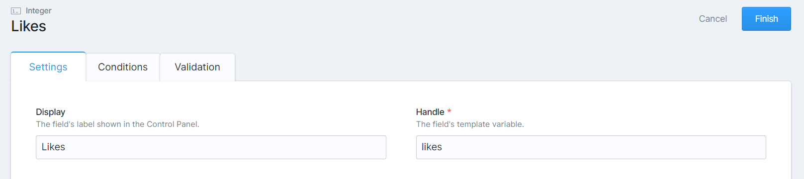

# Like

Like is a simple addon for Statamic that allows you to add a like button to your content that tracks how many likes the content or post has.

> You'll be surprised how much this little feature can increase engagement on your site.

## Installation

1. Install the addon using Composer:

    ```bash
    composer require thibaultferaux/statamic-like
    ```

## Usage

### Displaying the like button

It's simple! Just add this to where you want your like button to appear in your antlers template:

```antlers
{{ like }}
```

If you want to manage the likes in the dashboard, you can add an integer field to your blueprint (in the sidebar is the cleanest way to do it):


